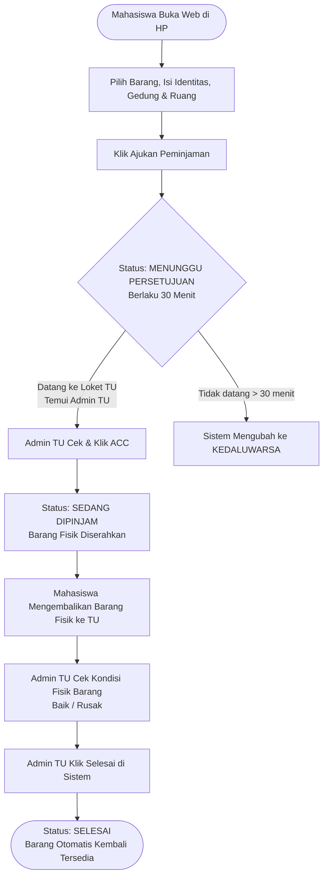

# 🏛️ SIMARIS: Panduan Alur Proses Bisnis & Rancangan Antarmuka (Wireframe)

Dokumen ini menjelaskan alur kerja, skenario penggunaan, dan rancangan tampilan sistem **SIMARIS (Sistem Manajemen Inventaris Kampus)** agar dapat dipahami dengan mudah oleh seluruh anggota tim.

---

## 👥 1. Peran Pengguna (User Roles)

Sistem ini dirancang untuk dua jenis pengguna utama:

1. **Mahasiswa (Peminjam)**:
   * Mengakses web melalui **HP (Smartphone)** tanpa perlu membuat akun atau login.
   * Memilih barang inventaris yang tersedia dan mengajukan permohonan peminjaman mandiri dengan mencantumkan lokasi pemakaian (**Gedung & Ruangan**).
2. **Admin TU / Petugas TU (Pengelola)**:
   * Mengakses web melalui **Komputer / Laptop Loket TU**.
   * Memvalidasi pengajuan, menyetujui peminjaman (ACC), dan mencatat pengembalian inventaris.

---

## 💡 2. Mengapa Mahasiswa Tidak Perlu Bikin Akun / Login?

Sering kali muncul ide: *"Kenapa mahasiswanya tidak disuruh bikin akun dan login dulu?"*  
Secara proses bisnis dan efisiensi pengerjaan, **meniadakan login mahasiswa adalah keputusan terbaik**. Berikut alasannya:

1. **Kebutuhan Lapangan Bersifat Mendesak (Zero Friction)**
   * Mahasiswa biasanya meminjam barang karena kebutuhan mendesak (contoh: 10 menit lagi dosen masuk, butuh proyektor segera).
   * Jika harus login: Mahasiswa harus *Register ➔ Buka Email Verifikasi ➔ Lupa Password ➔ Reset Password*. Ini memakan waktu dan membuat antrean loket TU menumpuk.
   * Tanpa login: Cukup buka alamat web di HP, isi form dalam 30 detik, selesai!
2. **Verifikasi Identitas Nyata di Meja Loket**
   * Akun digital (username/password) bisa dipinjam-pinjamkan antar teman.
   * Sebaliknya, mahasiswa yang datang langsung ke loket TU membawa kartu identitas (KTM/KTP) fisiknya sendiri. Admin TU bertatap muka langsung dengan peminjam, sehingga keaslian identitas jauh lebih terjamin di dunia nyata.
3. **Pola Layanan Publik Modern (Guest-First Approach)**
   * Sama seperti formulir pendaftaran kegiatan kampus, pemesanan tiket mandiri, atau antrean faskes: pengguna cukup mengisi identitas saat butuh tanpa dipaksa membuat akun seumur hidup.
4. **Fokus Pengerjaan Cepat (Hemat Waktu Tim)**
   * Membuat sistem login mahasiswa membutuhkan fitur tambahan: ganti password, lupa password, aktivasi email, dan kelola profil yang jarang digunakan.
   * Dengan meniadakan login mahasiswa, tim bisa fokus 100% menyempurnakan fitur inti: **katalog barang, transaksi peminjaman & pengembalian, serta laporan inventaris.**

---

## 🔄 3. Alur Proses Bisnis Utama

Berikut alur perjalanan peminjaman dari awal hingga barang selesai dikembalikan:



---

## 🛡️ 4. Aturan Bisnis Penting (Kebijakan Sistem)

1. **Barang Tidak Terkunci Otomatis**:
   * Saat mahasiswa baru sebatas mengisi formulir di HP, barang **belum terkunci** sebagai "Dipinjam".
   * Barang baru resmi terkunci setelah Admin TU memeriksa data di loket dan menekan tombol persetujuan (ACC).
   * *Manfaat*: Jika ada yang iseng mengisi formulir, inventaris kampus tidak akan tertahan sembarangan.
2. **Masa Berlaku Pengajuan (30 Menit)**:
   * Pengajuan formulir memiliki batas waktu 30 menit. Jika pemohon tidak datang ke loket TU dalam 30 menit, data pengajuan otomatis masuk ke status **Kedaluwarsa/Batal**.
3. **Pemisahan Data Lokasi (Gedung & Ruangan)**:
   * Setiap barang inventaris tercatat di **Gedung** dan **Ruangan** asalnya.
   * Saat meminjam, mahasiswa wajib memilih **Gedung** dan **Ruangan** tujuan barang akan digunakan agar inventaris mudah dicari jika terjadi kendala.
4. **SOP Fisik Loket (Di Luar Sistem)**:
   * Secara operasional di meja loket, mahasiswa tetap menyerahkan kartu identitas (KTM/KTP) fisik secara langsung ke tangan petugas sebagai jaminan manual. Sistem fokus pada pencatatan barang inventaris, tanpa perlu menyimpan data atau foto kartu identitas ke dalam aplikasi.

---

## 📱 5. Rancangan Tampilan (Wireframe)

### A. Sisi Mahasiswa (Tampilan HP / Mobile)

#### Layar 1: Formulir Peminjaman Mandiri
Mahasiswa langsung membuka alamat web di browser HP mereka, lalu mengisi form singkat:

```text
┌──────────────────────────────────────────────┐
│  🏛️ SIMARIS KAMPUS                           │
│  Layanan Peminjaman Inventaris Mandiri        │
├──────────────────────────────────────────────┤
│                                              │
│  📦 PILIH BARANG                             │
│  ┌────────────────────────────────────────┐  │
│  │ Proyektor Epson EB-X500             ▼  │  │ <- Hanya barang "Tersedia"
│  └────────────────────────────────────────┘  │
│  Lokasi Asal: Gedung A - Ruang Lab 201       │
│                                              │
│  👤 DATA DIRI PEMINJAM                       │
│  NIM:                                        │
│  ┌────────────────────────────────────────┐  │
│  │ 2201010041                             │  │
│  └────────────────────────────────────────┘  │
│  Nama Lengkap:                               │
│  ┌────────────────────────────────────────┐  │
│  │ Kevin Aqila                            │  │
│  └────────────────────────────────────────┘  │
│  Program Studi:                              │
│  ┌────────────────────────────────────────┐  │
│  │ Teknik Informatika                     │  │
│  └────────────────────────────────────────┘  │
│  No. WhatsApp Aktif:                         │
│  ┌────────────────────────────────────────┐  │
│  │ 0812-3456-7890                         │  │
│  └────────────────────────────────────────┘  │
│                                              │
│  📍 LOKASI PENGGUNAAN BARANG                 │
│  Gedung:                                     │
│  ┌────────────────────────────────────────┐  │
│  │ [ Gedung Kuliah Bersama (GKB)       ▼] │  │
│  └────────────────────────────────────────┘  │
│  Ruangan:                                    │
│  ┌────────────────────────────────────────┐  │
│  │ [ Ruang Kuliah 304                  ▼] │  │
│  └────────────────────────────────────────┘  │
│                                              │
│  ⏱️ KEPERLUAN & RENCANA PENGEMBALIAN          │
│  Keperluan Kegiatan:                         │
│  ┌────────────────────────────────────────┐  │
│  │ Presentasi Tugas Akhir Mata Kuliah     │  │
│  └────────────────────────────────────────┘  │
│  Rencana Jam Kembali:                        │
│  ┌────────────────────────────────────────┐  │
│  │ Hari ini, Pukul 15:30 WIB              │  │
│  └────────────────────────────────────────┘  │
│                                              │
│  ┌────────────────────────────────────────┐  │
│  │     🚀  KIRIM PERMINTAAN PINJAM        │  │
│  └────────────────────────────────────────┘  │
│                                              │
└──────────────────────────────────────────────┘
```

---

#### Layar 2: Konfirmasi Berhasil (Setelah Submit)
Setelah menekan tombol kirim, mahasiswa langsung mendapat konfirmasi singkat:

```text
┌──────────────────────────────────────────────┐
│  🏛️ SIMARIS KAMPUS                           │
├──────────────────────────────────────────────┤
│                                              │
│                     🎉                       │
│           PERMINTAAN TERKIRIM!               │
│                                              │
│  Data kamu sudah masuk ke antrean Admin TU.  │
│                                              │
│  ┌────────────────────────────────────────┐  │
│  │ 📍 LANGKAH SELANJUTNYA:                │  │
│  │                                        │  │
│  │ 1. Silakan langsung temui Admin TU     │  │
│  │    di Loket TU.                        │  │
│  │ 2. Sebutkan Nama & NIM kamu untuk      │  │
│  │    pengambilan barang.                 │  │
│  │                                        │  │
│  │ ⏳ Permintaan ini berlaku selama       │  │
│  │    30 menit ke depan.                  │  │
│  └────────────────────────────────────────┘  │
│                                              │
│  ┌────────────────────────────────────────┐  │
│  │          [ Selesai / Tutup ]           │  │
│  └────────────────────────────────────────┘  │
│                                              │
└──────────────────────────────────────────────┘
```

---

### B. Sisi Admin TU (Tampilan Layar Komputer / Laptop)

#### Layar 3: Dashboard Utama Pengelolaan Peminjaman
Admin TU melihat daftar permohonan yang diurutkan dari yang paling baru masuk, lengkap dengan info **Gedung & Ruangan**:

```text
┌──────────────────────────────────────────────────────────────────────────────────────────────────┐
│ 🏛️ SIMARIS ADMIN  |  [Dashboard]  [Data Barang]  [Peminjaman]  [Laporan]          (👤 Admin TU)   │
├──────────────────────────────────────────────────────────────────────────────────────────────────┤
│ 📋 Daftar Peminjaman Inventaris                                                                  │
│                                                                                                  │
│ [ Semua ]  [ 🟡 Menunggu ACC (2) ]  [ 🔵 Sedang Dipinjam (3) ]  [ 🟢 Selesai ]  [ Batal ]        │
│                                                                                                  │
│ 🔍 [ Cari Nama / NIM / Barang / Ruang... ]                             [ ⬇️ Export Laporan ]     │
│                                                                                                  │
│ ┌──────────────┬──────────────────┬─────────────────────────────┬──────────────┬─────────────┬───────────┐ │
│ │ PEMINJAM     │ BARANG           │ LOKASI PAKAI (GEDUNG/RUANG) │ WAKTU INPUT  │ STATUS      │ AKSI      │ │
│ ├──────────────┼──────────────────┼─────────────────────────────┼──────────────┼─────────────┼───────────┤ │
│ │ Kevin Aqila  │ Proyektor Epson  │ GKB - Ruang 304             │ 2 menit lalu │ 🟡 MENUNGGU │ [✔ ACC]   │ │
│ │ 2201010041   │                  │                             │              │             │ [✖ Tolak] │ │
│ ├──────────────┼──────────────────┼─────────────────────────────┼──────────────┼─────────────┼───────────┤ │
│ │ Siti Rahma   │ Mic Wireless     │ Gedung B - Aula             │ 10:15 WIB    │ 🔵 DIPINJAM │ [↩ Selesai│ │
│ │ 2201010088   │                  │                             │              │             │   Kembali]│ │
│ └──────────────┴──────────────────┴─────────────────────────────┴──────────────┴─────────────┴───────────┘ │
└──────────────────────────────────────────────────────────────────────────────────────────────────┘
```

---

#### Layar 4: Jendela Pop-up Aksi Admin TU

**1. Saat Admin TU Mengklik `[✔ ACC]`:**
> **Konfirmasi Penyerahan Barang**
> * Peminjam: Kevin Aqila (2201010041)
> * Barang: Proyektor Epson
> * Lokasi Pemakaian: **GKB - Ruang 304**
> * Keterangan: Serahkan barang fisik kepada mahasiswa pemohon.
> 
> `[ Batal ]` &nbsp;&nbsp;&nbsp;&nbsp; `[ Konfirmasi & Serahkan Barang ]`

**2. Saat Admin TU Mengklik `[↩ Selesai Kembali]` (Saat Barang Dikembalikan):**
> **Konfirmasi Pengembalian Barang**
> * Barang: Mic Wireless (Peminjam: Siti Rahma)
> * Kondisi Barang Saat Kembali: 
>   * `(o) Baik / Normal`
>   * `( ) Rusak / Bermasalah`
> * Catatan Tambahan: `[ Kabel dan receiver lengkap               ]`
> 
> `[ Batal ]` &nbsp;&nbsp;&nbsp;&nbsp; `[ Selesaikan Transaksi ]`
